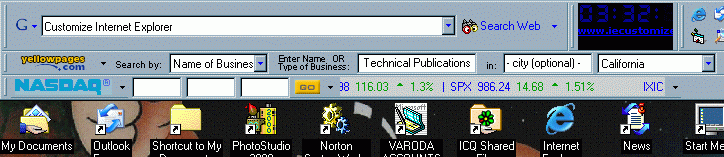

<div align="center">

## How to Add the Google Toobar to the Windows Taskbar


</div>

### Description

Here is a small registry tweak to Add the Google Toobar to your Windows Taskbar. Have the convenience of the Google Search bar on your Desktop as well as on Explorer. To implement this you will have already downloaded and installed the Google toolbar from http:\\www.google.com
 
### More Info
 


<span>             |<span>
---                |---
**Submitted On**   |
**By**             |[Rob Parsons](https://github.com/Planet-Source-Code/PSCIndex/blob/master/ByAuthor/rob-parsons.md)
**Level**          |Intermediate
**User Rating**    |5.0 (15 globes from 3 users)
**Compatibility**  |VB 6\.0, VB Script
**Category**       |[Internet/ HTML](https://github.com/Planet-Source-Code/PSCIndex/blob/master/ByCategory/internet-html__1-34.md)
**World**          |[Visual Basic](https://github.com/Planet-Source-Code/PSCIndex/blob/master/ByWorld/visual-basic.md)
**Archive File**   |[](https://github.com/Planet-Source-Code/rob-parsons-how-to-add-the-google-toobar-to-the-windows-taskbar__1-46033/archive/master.zip)


### Source Code

```
I came across this tweak quite by accident while I was researching how to create my own toolbars, but did you know that you can add toolbars to the Windows taskbar?
It seems to work seamlessly - If no web browser is open it will open an instance at the Google results page. The technique does not work for all Explorer Toolbars however. I suspect that it will only work for toolbars compiled with the ATL toolbars template as toolbars that have been created with Delphi do no instanciate as a deskband object, nor do they support skinning.
The secret is to add a registry entry to the google toolbar CLSID for Implemented Categories.
The secret is to add an entry for an Implemented Category for a DeskBand object.
HKCR\{Google Toolbar GUID}\Implemented Categories\{00021492-0000-0000-C000-000000000046}
Where "{00021492-0000-0000-C000-000000000046}" is the Deskband class GUID.
To do this on your own computer, open your registry editor and navigate to the Google's toolbar CLSID value under the HKEY_CLASSES_ROOT\CLSID Key. On my computer it has the value of "{2318C2B1-4965-11d4-9B18-009027A5CD4F}" but this may vary with the version of the toolbar that you have installed on your computer.
Create a new Key value under the above key and name it "Implemented Categories".
Under this new key also create another key with the name of "{00021492-0000-0000-C000-000000000046}" and give it a default value of "&Google" (which is the caption that will appear in the Taskbar context menu).
Press F5 to refresh your registry and the shell chache and when that has finished right-click on your Windows taskbar and the Google toolbar will appear in the list of available Taskbar toolbars.
One cavent is that you cannot park Taskbar on the desktop - It resizes to an unusable size and does not display the search box or buttons.
Enjoy your surfing.
Note: This tweak will not work for the new Google Toolbar beta 2.x. I have written to them to request this functionallity. Please visit toolbar.google.com to register your request for them to include this functionallity. THX.
```

